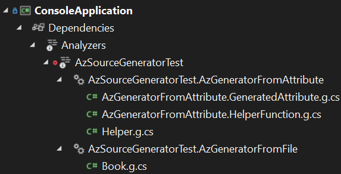
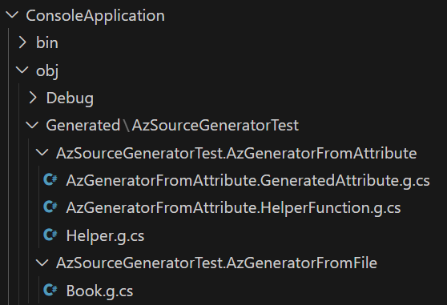

# Source generator test
Personal example on using Source Generator in Net (with C#) based from this video:

https://www.youtube.com/watch?v=azJm_Y2nbAI

There are two Source Generators in the AzSourceGeneratorTest project:
* AzGeneratorFromAttribute
* AzGeneratorFromFile

## AzGeneratorFromAttribute
This Source Generator uses attributes to insert into static and partial classes a method to assign a value to a variable by name. Example:

```
[AzGenerated(typeof(OtherObject))]
internal static partial class Helper { }
```

If the class *OtherObject* is:

```
public sealed class OtherObject
{
    public DateTime? DateTime { get; set; }
    public string? Comment { get; set; } = null!;
}
```

Source Generator creates this code:

```
internal static bool SetPropertyOtherObject(Models.OtherObject obj, ReadOnlySpan<char> propertyName, string? value) =>
    propertyName switch
    {
        "DateTime" => ConversionHelper.ParseDateTimeNullable(value, (x => { obj.DateTime = x; return true; })),
        "Comment" => ConversionHelper.ParseStringNullable(value, (x => { obj.Comment = x; return true; })),
        _ => false
    };
```

And it will be possible to assign a value to one of its properties with the code:

```
Helper.SetPropertyOtherObject(obj, "Comment", "My comment...")
```

## AzGeneratorFromFile
This Source Generator creates the classes from Csv files. By having this file Book.csv:

```
Title,varchar
Author,varchar
Pages,int
Description,varchar
Price,decimal
```

This class is created:

```
public sealed class Book
{
    public string Title { get; set; } = null!;
    public string Author { get; set; } = null!;
    public int Pages { get; set; }
    public string Description { get; set; } = null!;
    public double Price { get; set; }

    public override string ToString()
    {
        return $"{Title} {Author} {Pages} {Description} {Price} ";
    }
}
```

In addition, this Source Generator reads information from the .csproj file to configure the type of file to be searched and the namespace to be used.

## Files generated
Final result in Visual Studio:



Final result with VsCode:



These files are created in this directory only in Debug mode, thanks to the configuration of the .csproj file:

```
<PropertyGroup Condition="'$(Configuration)' == 'Debug'">
	<EmitCompilerGeneratedFiles>true</EmitCompilerGeneratedFiles>
	<CompilerGeneratedFilesOutputPath>$(BaseIntermediateOutputPath)Generated</CompilerGeneratedFilesOutputPath>
</PropertyGroup>
```
